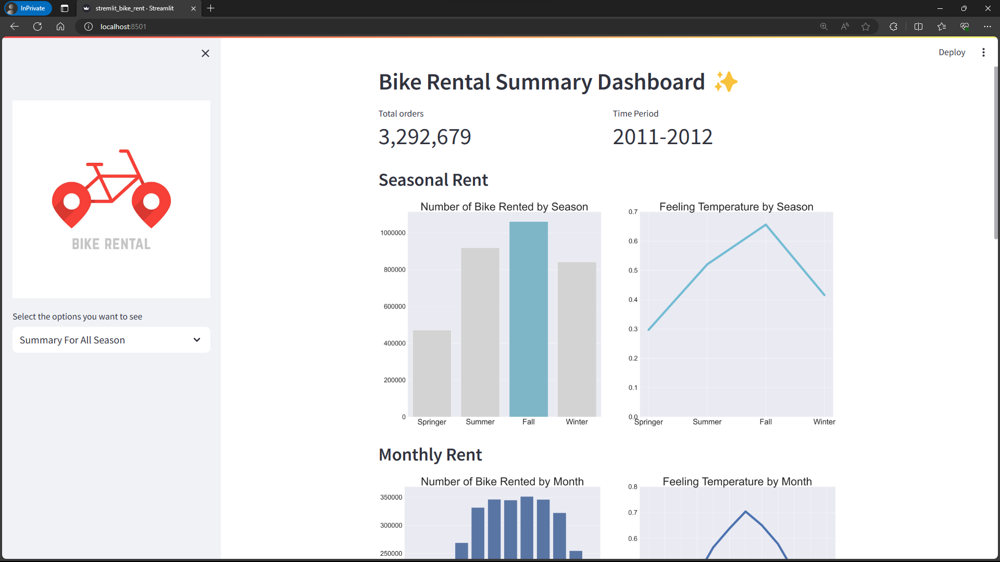
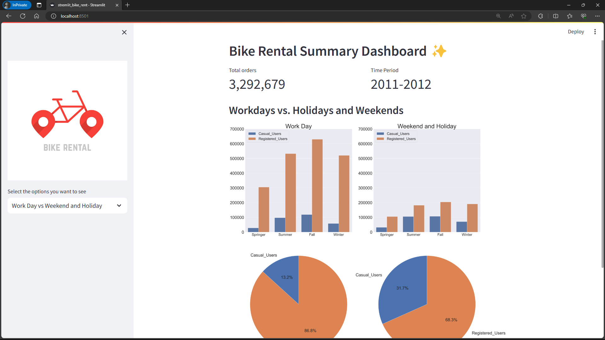

# Bike Rent Analysis ✨

## Question
1. Kapan musim dengan jumlah penyewaan sepeda tertinggi?
2. Bagaimana faktor lingkungan yang mempengaruhi jumlah penyewaan sepeda bulanan?
3. Bagaimana pengkategorian jumlah penyewaan sepeda bulanan akibat pengaruh faktor lingkungan?
4. Bagaimana perbandingan jumlah penyewaan musiman sepeda di hari kerja dan hari libur untuk kedua jenis user?

## Setup environment
```
pip install numpy pandas scipy matplotlib seaborn jupyter streamlit babel
```

## Run steamlit app
```
streamlit run stremlit_bike_rent.py
or
python -m streamlit run stremlit_bike_rent.py
```
## tautan untuk steamlit app
https://bike-rent-analysis-ipf2bmgymrjgwmnupgatra.streamlit.app/



